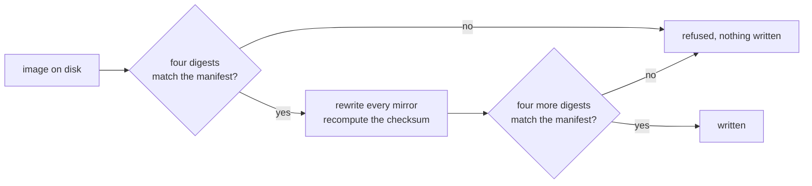

<div align="center">

<h1>Star Ocean, no chip</h1>

<strong>Two rebuilds that no longer need their coprocessor, and a header that never stopped claiming one.</strong>

<br>
<br>

[](https://github.com/gufranco/star-ocean-nochip-fix/actions/workflows/ci.yml)
[](#the-two-editions)
[](#tests)
[](LICENSE)

</div>

<p align="center">
  <a href="#quick-start">Quick start</a> &nbsp;|&nbsp;
  <a href="#what-is-wrong">What is wrong</a> &nbsp;|&nbsp;
  <a href="#the-two-editions">The two editions</a> &nbsp;|&nbsp;
  <a href="#why-both-ends-are-pinned">Why both ends are pinned</a> &nbsp;|&nbsp;
  <a href="https://github.com/gufranco/star-ocean-nochip-fix/issues">Issues</a>
</p>

**12** bytes changed per image · **2** header mirrors · **8** digests pinned per edition · **66** tests · **100%** statement and branch coverage

```bash
python3 starocean/fix.py roms dist
#   japanese: -> dist/star-ocean-jp-nochip.sfc (37131fc1…)
#   english:  -> dist/star-ocean-en-nochip.sfc (32bab94e…)
#   2 of 2 corrected
```

---

## What is wrong

Star Ocean shipped on an S-DD1 board. The chip decompressed graphics on the way to the console, which is how a 1996 cartridge fit a game that size.

Somebody else did the hard part years ago: decompressed all of it ahead of time and rebuilt the cartridge at ninety six megabit, so the S-DD1 has nothing left to do. Two of those rebuilds exist, one Japanese and one carrying the English translation.

Both still say, in their header, that an S-DD1 is fitted.

| Field | Says | Should say |
|:------|:-----|:-----------|
| Chipset | `0x45`, S-DD1 with save memory | `0x00`, no coprocessor |
| Declared size | `0x0D`, eight megabytes | `0x0E`, the first power of two that holds twelve |
| Checksum | Covers the old fields | Covers the new ones |

The size was wrong before anyone touched the file. The field holds a power of two and there is no power of two at twelve, so the rebuild inherited a declaration that never matched it.

## The solution

Nothing here reimplements any of it. `snes-mapper` decides where the header sits, `snes-rom-image` rewrites every mirror and recomputes the checksum, and this repository is the part that makes a small unattended change safe: it checks at both ends.



The order is the whole design. An image is confirmed before anything touches it, so a file that is not the one named never reaches the rewrite. The result is confirmed before it is written, so a rewrite that produced something unforeseen ends as a refusal rather than as a file on disk that looks finished.

## Quick start

### Prerequisites

| Tool | Version | Install |
|:-----|:--------|:--------|
| Python | >= 3.12 | [python.org](https://www.python.org/downloads/) |
| git | any | submodules are needed for the packages below |

### Setup

```bash
git clone --recurse-submodules https://github.com/gufranco/star-ocean-nochip-fix.git
cd star-ocean-nochip-fix
```

### Run

Put copies you already own in [`roms/`](roms/), keeping the filenames in [`roms/README.md`](roms/README.md), then:

```bash
python3 starocean/fix.py roms dist
```

Point `STAR_OCEAN_ROM_DIR` at a library somewhere else to read from there instead. A named directory wins even when it turns out to be empty, because quietly falling back from a path somebody typed turns a typo into a run that reports nothing needed doing.

## The two editions

| Edition | Reads | Writes |
|:--------|:------|:-------|
| `japanese` | the Japanese rebuild | `star-ocean-jp-nochip.sfc` |
| `english` | the same rebuild with the English translation | `star-ocean-en-nochip.sfc` |

Every filename and all eight digests per edition live in [`roms.manifest.json`](roms.manifest.json) and are printed in [`roms/README.md`](roms/README.md). The table is data rather than code: filenames and digests are the two things most likely to need a correction of their own, and a table nobody has to read Python to check is easier to correct.

## Why both ends are pinned

A correction whose output is not written down is a script, and a script that rewrites a header is indistinguishable from one that corrupts it. Both produce a file of exactly the right length.

So the manifest pins four digests of what goes in and four of what comes out. That buys three things:

- **A wrong input is caught before the rewrite.** A different revision of the rebuild has the right length and the wrong content, and it would otherwise be corrected into something nobody has ever tested.
- **A changed correction is caught after it.** If the input was the one named and the output is not the one promised, something about the correction itself moved, and the run says so instead of writing.
- **A manifest that contradicts itself is caught either way.** All four digests are confirmed, not just the deciding one. Publishing a crc32 beside a sha256 and never looking at the crc32 is publishing decoration.

## What actually changes

Twelve bytes. Six per header mirror, and there are two mirrors, at `0x7FC0` and `0xA07FC0`.

```text
0x7FC0 + 0x16   chipset          0x45 -> 0x00
0x7FC0 + 0x17   declared size    0x0D -> 0x0E
0x7FC0 + 0x1C   complement       recomputed
0x7FC0 + 0x1E   checksum         recomputed
```

A test asserts that nothing outside a header mirror moves, so the claim is checked rather than stated.

## Tests

```bash
for f in starocean/*.test.py conformance/*.test.py; do python3 "$f"; done
```

| Suite | File | Covers |
|:------|:-----|:-------|
| Editions | [`starocean/editions.test.py`](starocean/editions.test.py) | The manifest, digest widths, lookup by name and by digest |
| Fix | [`starocean/fix.test.py`](starocean/fix.test.py) | Correcting, confirming at both ends, every refusal, the command line |
| Version | [`starocean/version.test.py`](starocean/version.test.py) | One version, in the file the release script writes |
| Images | [`conformance/against_images.test.py`](conformance/against_images.test.py) | The real files: every pinned digest, and that only header mirrors move |

The last one is skipped rather than passed when neither image is present, so a run that proved nothing never reads as a run that proved something. CI attempts it on every push and annotates the skip.

## Built on

| Package | Does |
|:--------|:-----|
| [`snes-rom-image`](https://github.com/gufranco/snes-rom-image-python) | Finds every header mirror, rewrites the fields, recomputes the checksum |
| [`snes-mapper`](https://github.com/gufranco/snes-mapper-python) | Decides where a header is, out of the places one can be |

Both are carried as submodules. `snes-mapper` arrives nested inside `snes-rom-image`, which is why the clone above is recursive.

## Licence

MIT. See [`LICENSE`](LICENSE).

Neither image is distributed here and neither is reconstructible from anything in this repository. See [`roms/README.md`](roms/README.md).
