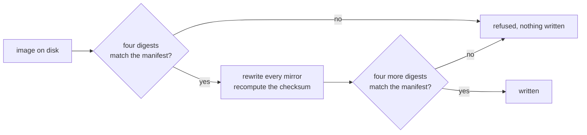

<div align="center">

<h1>Star Ocean, no chip: the header fix</h1>

<strong>neviksti took the S-DD1 out of Star Ocean. The header never noticed.</strong>

<br>
<br>

[](https://github.com/gufranco/star-ocean-nochip-fix/actions/workflows/ci.yml)
[](#the-two-editions)
[](#tests)
[](LICENSE)

</div>

<p align="center">
  <a href="#credit-where-it-belongs">Credit</a> &nbsp;|&nbsp;
  <a href="#quick-start">Quick start</a> &nbsp;|&nbsp;
  <a href="#what-is-wrong">What is wrong</a> &nbsp;|&nbsp;
  <a href="#the-two-editions">The two editions</a> &nbsp;|&nbsp;
  <a href="#why-both-ends-are-pinned">Why both ends are pinned</a> &nbsp;|&nbsp;
  <a href="https://github.com/gufranco/star-ocean-nochip-fix/issues">Issues</a>
</p>

**12** bytes changed per image · **2** header mirrors · **4** links of the chain pinned per edition · **119** tests · **100%** statement and branch coverage

```bash
star-ocean-verify           # reads only: says what is here and whether it is right
star-ocean-fix              # confirms, corrects, confirms again, writes
#   japanese: -> dist/star-ocean-jp-nochip.sfc (37131fc1…)
#   english:  -> dist/star-ocean-en-nochip.sfc (32bab94e…)
#   2 of 2 corrected
```

---

## Credit where it belongs

The hard part was done by other people, years ago, and none of it is repeated here.

| Who | What |
|:----|:-----|
| **neviksti** | Reverse-engineered the S-DD1 and wrote the [Star Ocean no S-DD1/96Mbit hack](https://www.romhacking.net/hacks/614/): decompresses the graphics ahead of time and rebuilds the cartridge at 96 Mbit, so the chip is not needed at all. Two patches, one for the Japanese original and one for the translated build. |
| **DeJap Translations** | The English translation the second patch is built on. |

This repository changes twelve bytes of a header. That is the entire contribution, and the ratio is worth being clear about.

neviksti's stated purpose is worth repeating because it is exactly why the header matters: the hack is **for real hardware**. Backup units like the Game Doctor SF7, flash carts and custom carts have no S-DD1, so an unmodified Star Ocean will not run on them. A header still advertising a chip that is not fitted is a loose end on work aimed squarely at hardware that reads headers.

## What is wrong

Star Ocean shipped on an S-DD1 board. The chip decompressed graphics on the way to the console, which is how a 1996 cartridge fit a game that size. After the patch the data is already decompressed and the chip has nothing left to do.

Both rebuilds still say, in their header, that an S-DD1 is fitted.

| Field | Says | Should say |
|:------|:-----|:-----------|
| Chipset | `0x45`, S-DD1 with save memory | `0x00`, no coprocessor |
| Declared size | `0x0D`, eight megabytes | `0x0E`, the first power of two that holds twelve |
| Checksum | Covers the old fields | Covers the new ones |

The size was wrong before anyone touched the file. The field holds a power of two and there is no power of two at twelve, so the rebuild inherited a declaration that never matched it.

## The solution

Nothing here reimplements any of it. [`snes-mapper`](https://github.com/gufranco/snes-mapper-python) decides where the header sits, [`snes-rom-image`](https://github.com/gufranco/snes-rom-image-python) rewrites every mirror and recomputes the checksum, and this repository is the part that makes a small unattended change safe: it checks at both ends.



The order is the whole design. An image is confirmed before anything touches it, so a file that is not the one named never reaches the rewrite. The result is confirmed before it is written, so a rewrite that produced something unforeseen ends as a refusal rather than as a file on disk that looks finished.

## Quick start

### Prerequisites

| Tool | Version | Install |
|:-----|:--------|:--------|
| Python | >= 3.12 | [python.org](https://www.python.org/downloads/) |
| git | any | submodules carry the two packages this is built on |

### Setup

```bash
git clone --recurse-submodules https://github.com/gufranco/star-ocean-nochip-fix.git
cd star-ocean-nochip-fix
```

### Run

You supply the files. Put whatever you have in [`roms/`](roms/) under the filenames in [`roms/README.md`](roms/README.md), then ask what is there:

```bash
python3 starocean/verify.py roms dist
#   japanese: source matches, Star Ocean (Japan).sfc
#   japanese: patch absent, 96Mbit_SO_JPN.xdelta
#   ...
```

That reads and writes nothing. When the image the correction consumes is present:

```bash
python3 starocean/fix.py roms dist
```

Installed, those are `star-ocean-verify` and `star-ocean-fix`.

Point `STAR_OCEAN_ROM_DIR` at a library somewhere else to read from there instead. A named directory wins even when it turns out to be empty, because quietly falling back from a path somebody typed turns a typo into a run that reports nothing needed doing.

## The two editions

The two patches are not interchangeable, which is why these are two editions rather than one with a flag.

| Edition | Starts from | Patch | Writes |
|:--------|:------------|:------|:-------|
| `japanese` | `Star Ocean (Japan).sfc` | `96Mbit_SO_JPN.xdelta` | `star-ocean-jp-nochip.sfc` |
| `english` | the same cartridge with DeJap's translation applied | `96Mbit_SO_ENG.xdelta` | `star-ocean-en-nochip.sfc` |

For the English chain the order matters and is neviksti's, not mine: apply DeJap's translation patch first and the 96 Mbit patch second. The other way round does not work.

## The whole chain is pinned, not just the ends

Pinning only the image the correction consumes tells you what to end up with and nothing about how. If you have the wrong file, the only thing it can say is "this is not the one named", when the useful answer is usually that the wrong patch was applied two steps earlier.

So every file between a cartridge you own and the image this writes carries four digests:


`star-ocean-verify` looks for all four links, reports each as absent, matching, altered or corrupt, and writes nothing. A report naming which link is wrong points at the step to redo.

Every filename and every digest lives in [`roms.manifest.json`](roms.manifest.json) and is printed in [`roms/README.md`](roms/README.md). The table is data rather than code: filenames and digests are the two things most likely to need a correction of their own, and a table nobody has to read Python to check is easier to correct.

## Why both ends are pinned

A correction whose output is not written down is a script, and a script that rewrites a header is indistinguishable from one that corrupts it. Both produce a file of exactly the right length.

So the manifest pins four digests of what goes in and four of what comes out. That buys three things:

- **A wrong input is caught before the rewrite.** A different revision of the patch produces a file of the right length and different content, and it would otherwise be corrected into something nobody has ever tested.
- **A changed correction is caught after it.** If the input was the one named and the output is not the one promised, something about the correction itself moved, and the run says so instead of writing.
- **A manifest that contradicts itself is caught either way.** All four digests are confirmed, not just the deciding one. Publishing a crc32 beside a sha256 and never looking at the crc32 is publishing decoration.

## What actually changes

Twelve bytes. Six per header mirror, and there are two mirrors, at `0x7FC0` and `0xA07FC0`.

```text
0x7FC0 + 0x16   chipset          0x45 -> 0x00
0x7FC0 + 0x17   declared size    0x0D -> 0x0E
0x7FC0 + 0x1C   complement       recomputed
0x7FC0 + 0x1E   checksum         recomputed
```

A test asserts that nothing outside a header mirror moves, so the claim is checked rather than stated. The game data the patch produced is not touched.

## Tests

```bash
for f in starocean/*.test.py conformance/*.test.py; do python3 "$f"; done
```

| Suite | File | Covers |
|:------|:-----|:-------|
| Editions | [`starocean/editions.test.py`](starocean/editions.test.py) | The manifest, digest widths, lookup by name and by digest |
| Fix | [`starocean/fix.test.py`](starocean/fix.test.py) | Correcting, confirming at both ends, every refusal, the command line |
| Verify | [`starocean/verify.test.py`](starocean/verify.test.py) | The four states, the verdict, and that nothing is ever written |
| Package | [`starocean/package.test.py`](starocean/package.test.py) | The exported surface, and that both commands resolve |
| Version | [`starocean/version.test.py`](starocean/version.test.py) | One version, in the file the release script writes |
| Images | [`conformance/against_images.test.py`](conformance/against_images.test.py) | The real files: every pinned digest, and that only header mirrors move |

The last one is skipped rather than passed when neither image is present, so a run that proved nothing never reads as a run that proved something. CI attempts it on every push and annotates the skip, and it runs the correction twice and compares what came out, because a correction that is not idempotent is one nobody can safely re-run and both runs write a file of the right length.

A weekly job checks whether the vendored packages have moved and opens an issue if so. Taking them stays a deliberate act: a header reader that changes what it reads changes what every pinned digest means.

## Built on

| Package | Does |
|:--------|:-----|
| [`snes-rom-image`](https://github.com/gufranco/snes-rom-image-python) | Finds every header mirror, rewrites the fields, recomputes the checksum |
| [`snes-mapper`](https://github.com/gufranco/snes-mapper-python) | Decides where a header is, out of the places one can be |

Both are carried as submodules. `snes-mapper` arrives nested inside `snes-rom-image`, which is why the clone above is recursive.

## Using it as a library

```python
from starocean import EDITIONS, look, report, apply

for line in report(look("roms", EDITIONS, "dist")):
    print(line)
```

`look` reads, `apply` corrects a supplied image and hands back the bytes, and neither writes anything. `run` is the one that writes.

## Licence

MIT, and it covers the code in this repository and nothing else.

Neither image is distributed here and neither is reconstructible from anything in this repository. Star Ocean belongs to its publisher, the S-DD1 removal is neviksti's work, and the English translation is DeJap's. See [`roms/README.md`](roms/README.md).

## Sources

- [Star Ocean no S-DD1/96Mbit hack](https://www.romhacking.net/hacks/614/), neviksti, on Romhacking.net
- [S-DD1](https://wiki.superfamicom.org/s-dd1), Super Famicom Development Wiki
- [SNES: Star Ocean English translation/hack](https://github.com/frederic-mahe/Hardware-Target-Game-Database/issues/622), Hardware Target Game Database
